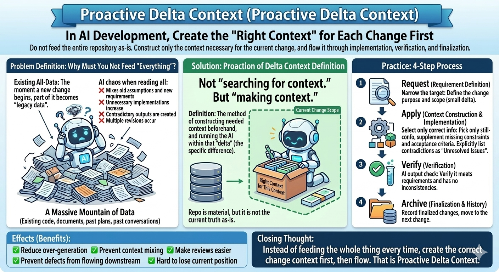

# bon-delta-workflows

`bon-delta-workflows` is a bootstrap tool and skill collection for running AI-assisted development as a lean, delta-based workflow.

It is built around **Proactive Delta Context**: keep work closed to the smallest useful change, verify it before it flows forward, and keep canonical project context in sync.

This package is the renamed and re-scoped successor to `bon-agents-md`. It started as AGENTS.md bootstrap tooling and evolved into a practical operating model for long-running LLM-assisted development.



It is designed for teams and solo developers who want to:

- start AI-assisted work quickly
- keep concept / spec / architecture / plan aligned
- reduce scope creep and document drift
- keep long-running AI work reviewable

---

## What It Generates

Run one command and `bon` creates:

- an editor-facing guide
  - `AGENTS.md` for Codex / OpenCode
  - `CLAUDE.md` for Claude Code
  - `.cursorrules` for Cursor
  - `copilot-instructions.md` for Copilot
- canonical project docs under `docs/`
  - `docs/OVERVIEW.md`
  - `docs/concept.md`
  - `docs/spec.md`
  - `docs/architecture.md`
  - `docs/plan.md`
  - `docs/delta/TEMPLATE.md`
  - `docs/delta/REVIEW_CHECKLIST.md`
- skills (optional)
  - includes `delta-bootstrap`
  - includes `delta-project-validator`
  - includes `delta-plan-shrinker`

`bon` no longer copies validator scripts into generated projects. Validator logic lives inside skills.

The generated structure is intentionally opinionated: the guide stays lean, and project-specific truth lives under `docs/`.

---

## Philosophy

`bon-delta-workflows` is a practical answer to a lean-development question:

**How do you keep AI work flowing without overproduction, context mixing, quality drift, or unfinished change inventory?**

Its answer is **Proactive Delta Context**:

> treat each change as a small, closed delta, give the agent only the context needed for that delta, verify the result before it moves forward, and archive the outcome so the next change starts clean.

Why is that necessary?

- existing code, docs, plans, and prior chat state are often partially stale the moment a new change starts
- if an agent reads all of that as equally valid context, old assumptions and new intent get mixed together
- that produces the typical failure modes of LLM work: over-generation, contradiction, unnecessary rewrites, and false confidence

Proactive Delta Context is the countermeasure:

- define the intended change before implementation
- create a delta context by selecting still-valid information and adding explicit scope, constraints, and acceptance criteria
- make mismatches explicit as scope, constraints, or follow-up deltas
- refuse to treat the whole repository as one continuously reliable prompt

In other words, the repository is valuable, but not automatically trustworthy as-is. A delta context is not merely extracted from the repository. It is created in advance so the agent works inside a context that is smaller, more explicit, and more correct.

This is why the workflow is intentionally opinionated:

- large requests are broken into small reviewable deltas
- canonical docs are updated as part of the same operating loop
- verification is a built-in quality gate, not a cleanup phase
- plan/archive hygiene is used to keep flow readable during long sessions

That leads to these operating principles:

1. Delta-first
   - Every requirement is handled as a delta:
     `delta request -> delta apply -> delta verify -> delta archive`
2. Canonical docs first
   - `docs/OVERVIEW.md` is the operational entrypoint
   - `concept / spec / architecture / plan` are the canonical project record
3. Minimal diffs
   - A delta should change only what it needs to change
   - speculative cleanup and unrelated refactors stay out
4. Review at milestones
   - when a major feature completes, run a `review delta`
   - if a plan item spreads across multiple deltas, review earlier
5. Keep the system readable
   - `plan.md` stays thin
   - archive details move to monthly archive files
   - oversized source files are reviewed and split

This is not just a prompt template. It is a lean-development thought experiment turned into a working operating model for AI-assisted development.

Reference:

- [`docs/philosophy.py`](docs/philosophy.py)

---

## Install

```bash
npm install -g bon-delta-workflows
```

Requires Node.js 16+.

Alternative install flow with the open skills ecosystem:

```bash
npx skills add kitfactory/bon-delta-workflows --agent codex --skill delta-bootstrap
```

That installs the skill only. It does not mutate the current project until you ask the agent to run the bootstrap skill.

For a pinned release, install from a tag:

```bash
npx skills add https://github.com/kitfactory/bon-delta-workflows/tree/v0.1.0 --agent codex --skill delta-bootstrap
```

---

## Basic Usage

```bash
bon
bon --dir path/to/project
bon --force
bon --lang ts
bon --agent claudecode
bon --agent cursor
bon --agent opencode
bon --skills none
bon --skills workspace
bon --skills user
bon --help
bon --version
```

Options:

- `--dir`: output directory
- `--force`: overwrite an existing guide file
- `--lang`: `python | js | ts | rust`
- `--agent`: `codex | claudecode | cursor | copilot | opencode`
- `--skills`: `none | workspace | user`

Meaning of `--skills`:

- `none`: generate guide + docs only
- `workspace`: install skills into the target project
- `user`: install skills into the agent's user-level skill directory

---

## How To Use It

### 1. Generate the guide and docs

```bash
bon --agent codex --skills workspace --lang python
```

Recommended defaults:

- `--agent codex`
- `--skills workspace`

Examples:

```bash
# docs + workspace skills for the current project
bon --agent codex --skills workspace

# docs only, no skill installation
bon --agent codex --skills none

# install skills to CODEX_HOME/skills and still generate project docs
bon --agent codex --skills user

# Claude Code project setup
bon --agent claudecode --skills workspace

# OpenCode project setup
bon --agent opencode --skills workspace
```

Skill scope examples:

```bash
# Use skills only inside this project
bon --agent codex --skills workspace

# Install reusable skills for your whole Codex environment
bon --agent codex --skills user
```

### 1b. Install through `skills add`

If you prefer the standard skills ecosystem, install the bootstrap skill:

```bash
npx skills add kitfactory/bon-delta-workflows --agent codex --skill delta-bootstrap
```

Or pin to a release tag:

```bash
npx skills add https://github.com/kitfactory/bon-delta-workflows/tree/v0.1.0 --agent codex --skill delta-bootstrap
```

Then ask the agent to initialize the repo, for example:

- `Initialize this repo to the bon standard`
- `AGENTS.md is missing, create the bon bootstrap files`
- `Create AGENTS.md and docs/OVERVIEW.md without overwriting existing files`

### 2. Open the entrypoint

Read:

- `AGENTS.md` or the editor-specific guide
- `docs/OVERVIEW.md`

`OVERVIEW.md` tells you:

- current scope
- canonical links
- review rules
- plan slimming rules
- delta operating rules

### 3. Add one small plan item

Start from `docs/plan.md`.

Keep it small. One plan item should normally become one delta seed.

### 4. Create a delta

Copy `docs/delta/TEMPLATE.md` into a new file:

```text
docs/delta/DR-YYYYMMDD-short-name.md
```

Fill in:

- `Delta Type`
- purpose
- In Scope
- Out of Scope
- Acceptance Criteria
- review gate requirement

### 5. Implement only the delta

Work only on AC-linked changes.

Do not mix in:

- unrelated refactors
- broad redesign
- speculative extension

### 6. Verify

Use the `delta-project-validator` skill.

And run the relevant tests for the change.

Important:

- generated projects do not receive `project/scripts/*.js`
- validator helpers belong to the installed skill
- repo-level `scripts/*.js` are only for developing `bon-delta-workflows` itself

### 7. Archive

When verify is PASS:

- archive the delta
- move plan completion into plan archive summary if needed
- sync canonical docs with minimal diffs

---

## Delta Types

The generated workflow supports these delta types:

- `FEATURE`
- `REPAIR`
- `DESIGN`
- `REVIEW`
- `DOCS-SYNC`
- `OPS`

### REVIEW delta

`REVIEW` is important for long-running AI work.

Use it when:

- a major feature is complete
- one plan item has grown into 3 or more deltas
- 5 non-review deltas have continued without a review
- architecture / docs / data hygiene need a checkpoint
- you simply want a design review now

Manual trigger examples:

- `run a review delta`
- `do a design review`

`REVIEW` delta uses:

- `docs/delta/REVIEW_CHECKLIST.md`

It checks:

- layer integrity
- docs sync
- data size / record hygiene
- code split health
- verify coverage

If problems are found, the review delta should record follow-up seeds rather than mixing large fixes into the review itself.

---

## Plan Slimming

`docs/plan.md` is intentionally thin.

It should contain only:

- `current`
- `review timing`
- `future`
- `archive`
- `archive index`

Detailed history moves into monthly files such as:

- `docs/plan_archive_2026_03.md`

Manual trigger examples:

- `shrink the plan`
- `organize the archive`

Use the `delta-plan-shrinker` skill when you trigger plan slimming manually.

Codex may also slim the plan when:

- the archive section exceeds 100 lines
- archive becomes clearly larger than current + future

---

## Validation

Use the `delta-project-validator` skill.

Checks:

- `docs/plan.md`
- `docs/delta/DR-*.md`
- archive PASS consistency

Defaults:

- over 500 lines: review target
- over 800 lines: should be split
- over 1000 lines: exception only

This applies to source-code file extensions, not Markdown docs.

---

## Practical Working Pattern

A realistic cycle looks like this:

1. add one plan item
2. create one delta
3. implement the smallest useful change
4. verify with tests + validators
5. archive
6. run a `REVIEW` delta at a meaningful boundary
7. slim the plan when it starts getting noisy

That is the intended workflow.

---

## Generated Structure

### Guides

- Codex / OpenCode: `AGENTS.md`
- Claude Code: `CLAUDE.md`
- Cursor: `.cursorrules`
- Copilot: `copilot-instructions.md`

### Canonical docs

- `docs/OVERVIEW.md`
- `docs/concept.md`
- `docs/spec.md`
- `docs/architecture.md`
- `docs/plan.md`
- `docs/delta/TEMPLATE.md`
- `docs/delta/REVIEW_CHECKLIST.md`

### Skills

With `--skills workspace`:

- codex: `./.codex/skills`
- claudecode: `./.claude/skills`
- cursor: `./.cursor/skills`
- copilot: `./.github/copilot/skills`
- opencode: `./.opencode/skills`

With `--skills user`:

- codex: `${CODEX_HOME}/skills` or `~/.codex/skills`
- claudecode: `~/.claude/skills`
- opencode: `~/.config/opencode/skills`

Notes for `user` scope:

- Codex: this follows the actual Codex skill layout: `${CODEX_HOME}/skills/<skill-name>/SKILL.md`
- Claude Code: this follows the Claude Code skill layout: `~/.claude/skills/<skill-name>/SKILL.md`
- OpenCode: this follows the OpenCode skill layout: `~/.config/opencode/skills/<skill-name>/SKILL.md`
- Cursor: unsupported
- Copilot: unsupported
- `bon` exits with an error if you use `--agent cursor --skills user` or `--agent copilot --skills user`

With `--skills none`, `bon` skips skill installation, so `delta-project-validator` and `delta-plan-shrinker` are not installed.

Relevant skills:

- `delta-project-validator`
- `delta-plan-shrinker`

Skill ownership model:

- project docs and guides are bootstrap output
- files under `skills/<skill-name>/` are skill-owned assets
- validator helpers belong to `delta-project-validator`
- plan archive shrinking logic belongs to `delta-plan-shrinker`

---

## Locale

Locale is inferred from:

- `LANG`
- `LC_ALL`
- OS locale

WSL prefers Windows locale.

If the locale is Japanese, generated docs are Japanese-oriented.

---

## Development

Run tests:

```bash
npm test
```

Run repository validators:

```bash
node scripts/validate_delta_links.js --dir .
node scripts/check_code_size.js --dir .
```

These repo-level scripts are for maintaining this repository, not for generated projects.

---

## Why This Shape Works

This project is intentionally biased toward:

- clarity over cleverness
- reviewable milestones over fully open-ended AI autonomy
- canonical documentation over scattered notes
- controlled evolution over prompt sprawl

If you want AI to work longer without drifting, this shape is the point.


